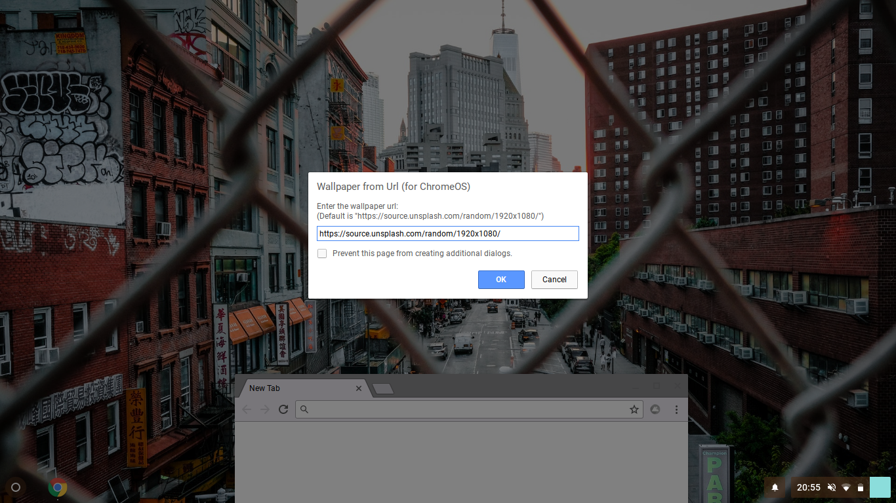

# Wallpaper from Url (for ChromeOS)  
This chrome extension sets your wallpaper in ChromeOS to a image url. Works great with random wallpaper urls, like Unsplash Source. The default url is [https://source.unsplash.com/random/1920x1080/](https://source.unsplash.com/random/1920x1080/).
## Installation
Download the extension [here](https://raw.github.com/rpbritton/wallpaper-from-url-for-chromeos/master/wallpaper-from-url-for-chromeos.crx) 
or load the `src` directory of this repository as an unpacked extension in `chrome://extensions`.
___

